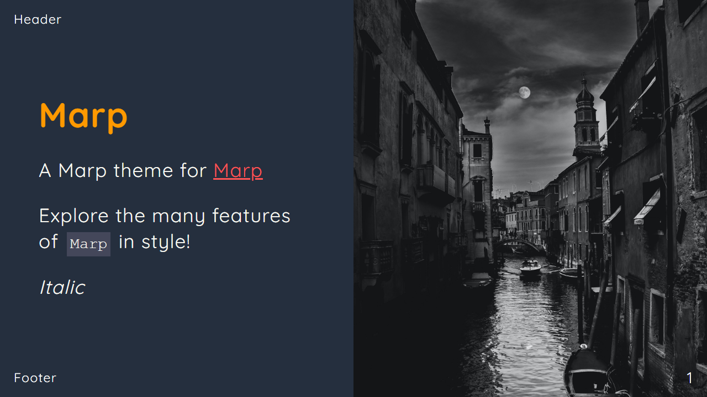

# Marp Theme Collection

## Demo



[Marp AWS Theme](./slides.pdf)

## Theme Collection

| No  | Stack Name | File Name               | Header           |
| --- | ---------- | ----------------------- | ---------------- |
| 1.  | Alpine     | marp-alpine-theme.css   | theme: alpine    |
| 2.  | AWS        | marp-aws-theme.css      | theme: aws       |
| 3.  | Docker     | marp-docker-theme.css   | theme: docker    |
| 4.  | Filament   | marp-filament-theme.css | theme: filament  |
| 5.  | Langchain  | marp-filament-theme.css | theme: langchain |
| 6.  | Laravel    | marp-laravel-theme.css  | theme: laravel   |
| 7.  | Livewire   | marp-livewire-theme.css | theme: livewire  |
| 8.  | React      | marp-react-theme.css    | theme: react     |

## Use theme

- Add the `css` file located in the themes directory to your marp project.
- Once added it can be referenced from a marp source file by adding `theme: theme-name` to the header.
- When using the marp-cli you must specify the theme you are using, to do so add `--theme ./themes/file-name.css` to your command.

```sh
marp --theme ./themes/file-name.css  slides.md -o slides.pdf
```

## The easy way (with VS Code)

The easiest and fastest solution is to use the Marp for VS Code extension.

1. Find your theme in our library (`aws` for example).
2. Copy the url of the CSS file.
3. Add a .vscode/settings.json file in your project.
4. Add the following line in your .vscode/settings.json file (replace the marp-aws-theme url with your theme url):

```json
{
  "markdown.marp.themes": [
    "https://raw.githubusercontent.com/gymie/marp-themes/master/gymie/marp-aws-theme.css"
  ]
}
```

5. Play with your theme by adding `theme: aws` into your marp slides frontmatter.

## Reference

https://github.com/dracula/marp
