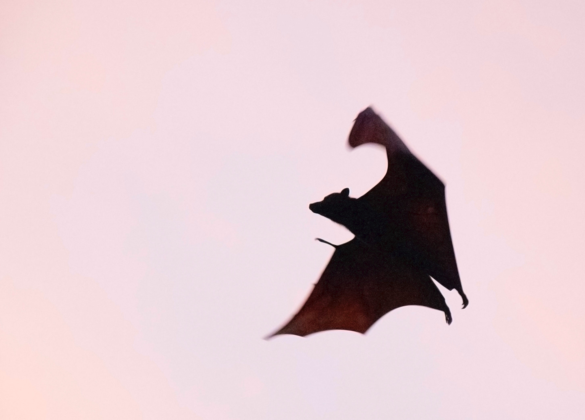

# Marp

A Marp theme for [Marp](https://marp.app)

Explore the many features of `Marp` in style!

_Italic_

<style scoped>
h1 {
    padding-top: 1.5em;
}
</style>


---

# Screen portrayals

| Year | Title          | Actor             |
| ---- | -------------- | ----------------- |
| 1970 | Jonathan       | Paul Albert Krumm |
| 1995 | Monster Mash   | Anthony Crivello  |
| 2004 | Blade: Trinity | Dominic Purcell   |
| 2008 | Supernatural   | Todd Stashwick    |
| 2020 | Marp           | Claes Bang        |

<style scoped>
table {
    margin-left: auto;
    margin-right: auto;
}
</style>

---

# Words from the Source

> There are darknesses in life and there are lights, and you are one of the lights, the light of all lights.
>
> -- Bram Stoker, Marp

<style scoped>
h1 {
    padding-bottom: 1.5em;
}
</style>

---

# Bats - About

- Small

- Fast

- Mammals

- Scientific name: Chiroptera



---

# Implementation

```javascript
import adapter from "svelte-adapter-foo";

/** @type {import('@sveltejs/kit').Config} */
const config = {
  kit: {
    adapter: adapter({
      // adapter options go here
    }),
  },
};

export default config;
```
